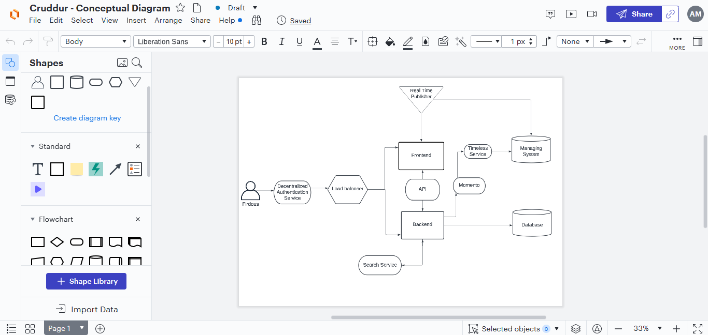

# Week 0 — Billing and Architecture

## Required Homework/Tasks

## Recreating Conceptual and Logical Diagrams in Lucid Charts

I was able to create my own conceptual and logical diagrams using the lucid chart environment.
This was possible due to the live stream of Week 0 hosted by Andrew and the guest speakers,
And also follow up videos on his youtube channel talking about recreating diagrams on Lucid Chart.
Also i was able to come up with my own napkin design for my diagrams.
Here are my links to show that i did do the diagrams on lucid.

## Conceptual Diagram Link in Lucid
https://lucid.app/lucidchart/96b5fa66-ec05-45af-8f2a-fedff19908f2/edit?invitationId=inv_b20c0491-2db7-4d17-b5ef-7c46b2024342 

## Architectural Diagram in Lucid
https://lucid.app/lucidchart/5d50320c-5693-4ac4-b941-4797e7f89f95/edit?viewport_loc=-378%2C189%2C2386%2C1154%2C0_0&invitationId=inv_405cef54-c734-4a45-9ad0-31b0b720bc45

## Image proofs of diagrams 
Proof 

Proof 

Proof 

### Create a Budget

I was able to create my budget alarm on my AWS Console manually and also create it using AWS CLI.
Proof 

### Create a Billing Alarm
I was able to create my billing alarm on my AWS Console manually and also create it using AWS CLI.
Proof 
